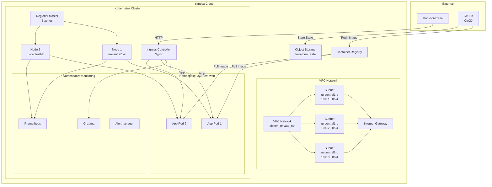
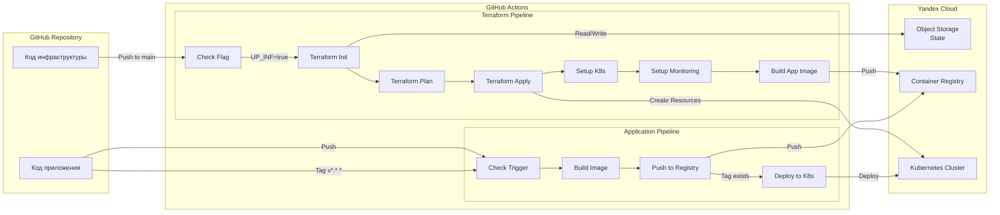
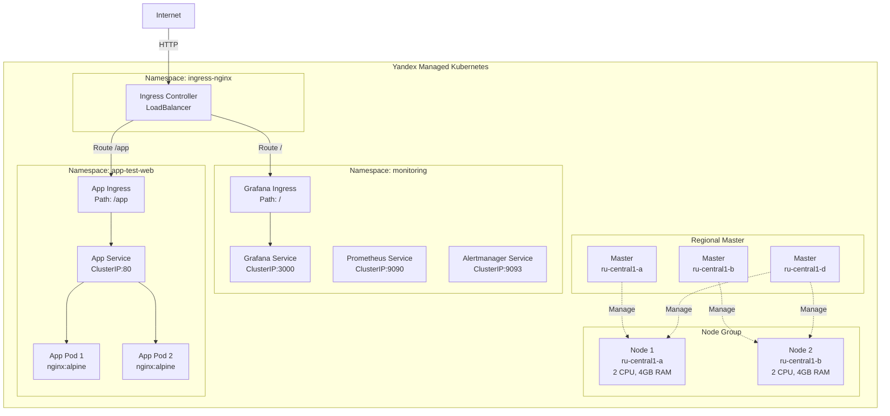
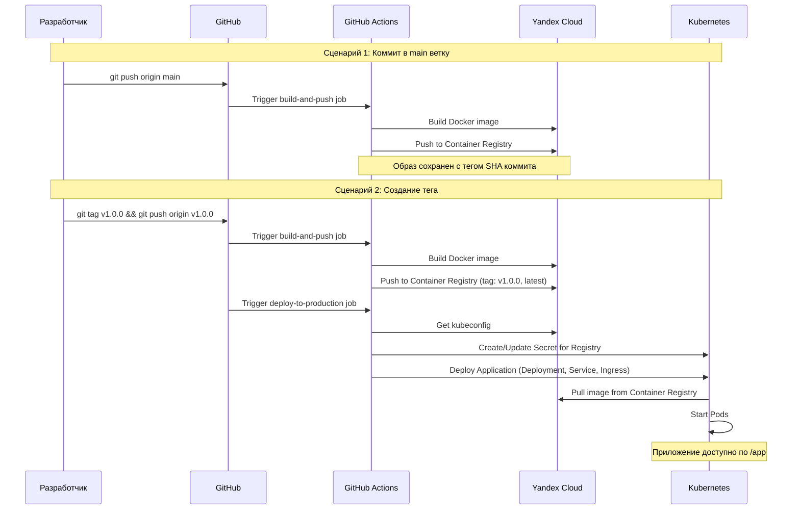

# Дипломный практикум в Yandex.Cloud

## Цели:

1. Подготовить облачную инфраструктуру на базе облачного провайдера Яндекс.Облако.
2. Запустить и сконфигурировать Kubernetes кластер.
3. Установить и настроить систему мониторинга.
4. Настроить и автоматизировать сборку тестового приложения с использованием Docker-контейнеров.
5. Настроить CI для автоматической сборки и тестирования.
6. Настроить CD для автоматического развёртывания приложения.

---

## Этапы выполнения:

### Создание облачной инфраструктуры

Для начала необходимо подготовить облачную инфраструктуру в Yandex Cloud с помощью Terraform.

**Требования:**
- Все конфигурации должны быть описаны в коде с использованием Terraform
- State файлы должны храниться в удаленном backend (Yandex Object Storage)
- Применение изменений должно быть автоматизировано через CI/CD (GitHub Actions)
- Должна быть возможность выполнить команды `terraform destroy` и `terraform apply` без дополнительных ручных действий

**Ожидаемые результаты:**
1. Terraform сконфигурирован и создание инфраструктуры посредством Terraform возможно без дополнительных ручных действий, стейт основной конфигурации сохраняется в бакете или Terraform Cloud
2. Полученная конфигурация инфраструктуры является предварительной, поэтому в ходе дальнейшего выполнения задания возможны изменения.

---

### Создание Kubernetes кластера

На этом этапе необходимо создать Kubernetes кластер на базе предварительно созданной инфраструктуры. Требуется обеспечить доступ к ресурсам из Интернета.

**Выбранный вариант:** Использование сервиса Yandex Managed Service for Kubernetes

**Ожидаемый результат:**
1. Работоспособный Kubernetes кластер.
2. В файле `~/.kube/config` находятся данные для доступа к кластеру.
3. Команда `kubectl get pods --all-namespaces` отрабатывает без ошибок.

---

### Создание тестового приложения

Для перехода к следующему этапу необходимо подготовить тестовое приложение, эмулирующее основное приложение разрабатываемое вашей компанией.

**Способ подготовки:**
- Создан отдельный git репозиторий с простым nginx конфигом, который отдает статические данные
- Подготовлен Dockerfile для создания образа приложения

**Ожидаемый результат:**
1. Git репозиторий с тестовым приложением и Dockerfile.
2. Регистр с собранным docker image. В качестве регистра используется Yandex Container Registry, созданный также с помощью terraform.

---

### Подготовка системы мониторинга и деплой приложения

Уже должны быть готовы конфигурации для автоматического создания облачной инфраструктуры и поднятия Kubernetes кластера.  
Теперь необходимо подготовить конфигурационные файлы для настройки нашего Kubernetes кластера.

**Цель:**
1. Задеплоить в кластер prometheus, grafana, alertmanager, экспортер основных метрик Kubernetes.
2. Задеплоить тестовое приложение, например, nginx сервер отдающий статическую страницу.

**Способ выполнения:**
- Использован пакет kube-prometheus, который включает в себя Kubernetes оператор для grafana, prometheus, alertmanager и node_exporter.

### Деплой инфраструктуры в terraform pipeline

Настроен автоматический запуск и применение конфигурации terraform из git-репозитория в GitHub Actions при любом коммите в main ветку.

**Ожидаемый результат:**
1. Git репозиторий с конфигурационными файлами для настройки Kubernetes.
2. Http доступ на 80 порту к web интерфейсу grafana.
3. Дашборды в grafana отображающие состояние Kubernetes кластера.
4. Http доступ на 80 порту к тестовому приложению.
5. CI/CD-terraform pipeline

---

### Установка и настройка CI/CD

Осталось настроить ci/cd систему для автоматической сборки docker image и деплоя приложения при изменении кода.

**Цель:**
1. Автоматическая сборка docker образа при коммите в репозиторий с тестовым приложением.
2. Автоматический деплой нового docker образа.

**Использовано:** GitHub Actions

**Ожидаемый результат:**
1. Интерфейс ci/cd сервиса доступен по http.
2. При любом коммите в репозиторие с тестовым приложением происходит сборка и отправка в регистр Docker образа.
3. При создании тега (например, v1.0.0) происходит сборка и отправка с соответствующим label в регистри, а также деплой соответствующего Docker образа в кластер Kubernetes.

---

## Что необходимо для сдачи задания?

1. Репозиторий с конфигурационными файлами Terraform и готовность продемонстрировать создание всех ресурсов с нуля.
2. Пример pull request с комментариями созданными atlantis'ом или снимки экрана из Terraform Cloud или вашего CI-CD-terraform pipeline.
3. Репозиторий с конфигурацией ansible, если был выбран способ создания Kubernetes кластера при помощи ansible.
4. Репозиторий с Dockerfile тестового приложения и ссылка на собранный docker image.
5. Репозиторий с конфигурацией Kubernetes кластера.
6. Ссылка на тестовое приложение и веб интерфейс Grafana с данными доступа.
7. Все репозитории рекомендуется хранить на одном ресурсе (github, gitlab)

---

## Выполнение диплома

### Этап 1: Создание облачной инфраструктуры

#### 1.1. Настройка Terraform Backend

Согласно заданию для хранения state файлов Terraform был создан удаленный backend на базе Yandex Object Storage. Это условие необходимо выполнить, так как создание инфраструктуры автоматизировано и выполняется на временных виртуальных средах (GitHub Actions Workers).

**Terraform модуль для создания backend:**

Модуль находится в директории `terrafom-backend/` и содержит:
- `main.tf` - основной манифест с ресурсами (сервисный аккаунт, Static Access Keys, S3 бакет)
- `variables.tf` - переменные модуля (folder_id, bucket_name_prefix и др.)
- `outputs.tf` - выходные значения (bucket_name, access_key_id, secret_access_key и др.)
- `providers.tf` - конфигурация провайдера Yandex Cloud
- `terraform.tfvars.example` - пример файла переменных

**Скрипт управления backend (`manage-backend.sh`):**

Для удобства работы был создан интерактивный скрипт для управления Terraform Backend предоставляет следующие возможности:
1. **Создать S3 бакет и настроить backend** - создает все необходимые ресурсы и конфигурационные файлы
2. **Удалить S3 бакет и все ресурсы** - удаляет созданные ресурсы
3. **Показать текущую конфигурацию** - отображает информацию о текущем backend
4. **Инициализировать backend** - выполняет `terraform init` в директории backend
5. **Деинициализировать backend** - очищает локальные файлы backend
6. **Протестировать инфраструктуру** - выполняет `terraform plan` для проверки конфигурации

**Файлы, используемые скриптом:**

**Входные файлы :**
- `~/.authorized_key.json` - JSON ключ сервисного аккаунта для работы с Yandex Cloud
- `terrafom-backend/terraform.tfvars` - переменные для модуля backend 

**Выходные файлы (создаются скриптом):**

1. **`terrafom-backend/credentials.env`** - файл с учетными данными для backend:
   ```bash
   export AWS_ACCESS_KEY_ID="..."
   export AWS_SECRET_ACCESS_KEY="..."
   export TERRAFORM_STATE_BUCKET="diplom-kh-YYYYMMDD-HHMMSS"
   export TERRAFORM_STATE_SERVICE_ACCOUNT="..."
   ```

2. **`infrastructure/backend.tf`** - несекретная конфигурация Terraform backend (можно коммитить):
   ```hcl
   terraform {
     backend "s3" {
       bucket = "diplom-kh-YYYYMMDD-HHMMSS"
       key    = "terraform.tfstate"
       # ... конфигурация endpoint и region
     }
   }
   ```

3. **`infrastructure/backend-secrets.tfvars`** - секретные данные для backend (не коммитится, добавлен в `.gitignore`):
   ```hcl
   access_key = "..."
   secret_key = "..."
   ```

4. **`infrastructure/.authorized_key.json`** - JSON ключ сервисного аккаунта для локальной разработки (не коммитится)

5. **`infrastructure/terraform.tfvars`** - переменные Terraform для основной инфраструктуры (создается/обновляется автоматически из `yc config`)


**Файловая структура после выполнения скрипта:**

```
.
├── terrafom-backend/                    # Terraform модуль для создания backend
│   ├── main.tf                         # Основной манифест
│   ├── variables.tf                    # Переменные
│   ├── outputs.tf                      # Выходные значения
│   ├── providers.tf                    # Конфигурация провайдера
│   ├── terraform.tfvars                # Переменные (создается/используется скриптом)
│   ├── terraform.tfvars.example        # Пример переменных
│   └── credentials.env                 # Учетные данные (создается скриптом) 
├── infrastructure/                      # Основная инфраструктура
│   ├── backend.tf                      # Конфигурация backend (создается скриптом)
│   ├── backend-secrets.tfvars          # Секретные данные backend (создается скриптом)
│   ├── .authorized_key.json            # JSON ключ сервисного аккаунта (создается скриптом)
│   └── terraform.tfvars                # Переменные Terraform (создается/обновляется скриптом)
└── manage-backend.sh                   # Интерактивный скрипт управления backend
```


#### 1.2. Создание инфраструктуры

После настройки Terraform Backend выполняется создание основной облачной инфраструктуры с помощью Terraform. Все ресурсы описываются в коде и создаются автоматически через CI/CD pipeline.Код манифестов написан так чтоб мог выполнятся в облаке. Также для удобства отладки был создан скрипт **infra-diplom.sh** позволяющий упростить отладку деплоя инфраструктуры.
Далее кратко представлены в человекочитаемой форме наполнение манифестов

**1.2.1. Создание VPC сети**

Создана VPC сеть (`diplom_private_net`) с тремя подсетями в разных зонах доступности для обеспечения отказоустойчивости:

- **ru-central1-a**: подсеть `10.0.10.0/24`
- **ru-central1-b**: подсеть `10.0.20.0/24`
- **ru-central1-d**: подсеть `10.0.30.0/24`

Настроен Internet Gateway (`shared_egress_gateway`) и таблица маршрутизации для обеспечения доступа ресурсов в интернет. Все подсети привязаны к таблице маршрутизации с маршрутом `0.0.0.0/0` через Internet Gateway.

**Конфигурация в Terraform:**
- `yandex_vpc_network` - создание VPC сети
- `yandex_vpc_gateway` - создание Internet Gateway
- `yandex_vpc_route_table` - создание таблицы маршрутизации
- `yandex_vpc_subnet` - создание подсетей в трех зонах доступности

**1.2.2. Создание Kubernetes кластера**

Создан региональный Kubernetes кластер с использованием Yandex Managed Kubernetes.

**Конфигурация мастера (Master):**
- **Тип:** Региональный мастер с размещением в 3 зонах доступности (ru-central1-a, ru-central1-b, ru-central1-d)
- **Публичный доступ:** Включен для доступа к API кластера из интернета
- **Канал релиза:** STABLE
- **Сетевая политика:** CALICO
- **Автоматическое обновление:** Включено (воскресенье, 03:00, длительность 3 часа)

**Конфигурация Node Group (воркеры):**
- **Количество нод:** 2
- **Платформа:** standard-v2
- **Ресурсы на ноду:** 2 CPU, 4 GB RAM
- **Диск:** 64 GB network-ssd
- **Тип инстансов:** Прерываемые (preemptible) для минимизации расходов
- **Размещение:** Распределение по 3 зонам доступности (ru-central1-a, ru-central1-b, ru-central1-d)
- **Автоматическое восстановление:** Включено
- **Автоматическое обновление:** Включено

**Сервисные аккаунты:**

1. **Сервисный аккаунт кластера** (`{cluster-name}-cluster-sa`) с ролями:
   - `k8s.clusters.agent` - управление кластером
   - `vpc.publicAdmin` - управление публичными IP-адресами
   - `vpc.user` - работа с сетью
   - `container-registry.images.puller` - загрузка образов из Container Registry
   - `compute.viewer` - просмотр вычислительных ресурсов
   - `load-balancer.admin` - управление балансировщиками нагрузки
   - `editor` - полные права на папку для создания LoadBalancer и других ресурсов

2. **Сервисный аккаунт нод** (`{cluster-name}-node-sa`) с ролями:
   - `container-registry.images.puller` - загрузка образов из Container Registry
   - `compute.viewer` - просмотр вычислительных ресурсов


**1.2.3. Создание Container Registry**

Создан Yandex Container Registry для хранения Docker образов приложения. Registry используется для:


**Результаты создания инфраструктуры:**

После успешного выполнения `terraform apply` создаются следующие ресурсы:
- VPC сеть с тремя подсетями и Internet Gateway
- Региональный Kubernetes кластер с мастером в 3 зонах
- Node Group с двумя воркерами
- Два сервисных аккаунта с необходимыми ролями
- Container Registry для хранения Docker образов
- Terraform state файл сохраняется в Object Storage (backend)


---

### Этап 2: Создание Kubernetes кластера

#### 2.1. Конфигурация кластера

Создан региональный Kubernetes кластер с использованием Yandex Managed Kubernetes:
Включен публичный  доступ к API кластера из интернета

#### 2.2. Конфигурация Node Group

Создана группа нод с следующими параметрами:
- **Количество нод:** 2
- **Платформа:** standard-v2
- **Ресурсы:** 2 CPU, 4 GB RAM
- **Диск:** 64 GB network-ssd
- **Тип инстансов:** Прерываемые (preemptible) для минимизации расходов
- **Размещение:** Распределение по 2 зонам доступности
- **Автоматическое восстановление:** Включено

#### 2.3. Сервисные аккаунты

Созданы два сервисных аккаунта:
1. **Сервисный аккаунт кластера** с ролями:
   - `k8s.clusters.agent`
   - `vpc.publicAdmin`
   - `vpc.user`
   - `container-registry.images.puller`
   - `compute.viewer`
   - `load-balancer.admin`
   - `editor`

2. **Сервисный аккаунт нод** с ролями:
   - `container-registry.images.puller`
   - `compute.viewer`
### Результат выполнения манифестов

![[Pasted image 20251202221214.png]]

---

### Этап 3: Создание тестового приложения

#### 3.1. Репозиторий приложения

Создан отдельный репозиторий `https://github.com/ekhristin/app-test-web.git` с тестовым приложением на базе Nginx.

**Структура приложения:**
```
app-test-web/
├── Dockerfile          # Docker образ на базе nginx:alpine
├── nginx.conf          # Конфигурация Nginx
└── index.html          # Статическая HTML страница
```

**Dockerfile:**
```dockerfile
FROM nginx:alpine
COPY nginx.conf /etc/nginx/nginx.conf
COPY index.html /usr/share/nginx/html/index.html
EXPOSE 80
CMD ["nginx", "-g", "daemon off;"]
```

**nginx.conf:**
```nginx
events {}

http {
    server {
        listen 80;
        location / {
            root /usr/share/nginx/html;
            index index.html;
        }
    }
}
```

#### 3.2. Сборка и публикация образа

Образ собирается автоматически через GitHub Actions и публикуется в Yandex Container Registry. Также на момент тестирования и отладки предусмотрено локальная сборка и публикация образа в регестри яндекса.

---

### Этап 4: Подготовка системы мониторинга и деплой приложения
На этом этапе мной уже подготовлен экшен в github запускает с нуля создание инфраструктуры из манифестов 1.2. ,2, 3 с публикацией приложения и инструмента мониторинга grafana
#### 4.1. Установка Ingress Controller

Установлен Nginx Ingress Controller для маршрутизации внешнего трафика в кластер:
- Версия: controller-v1.11.1
- Тип сервиса: LoadBalancer
- Автоматическое назначение внешнего IP адреса

#### 4.2. Установка kube-prometheus stack

Установлен полный стек мониторинга kube-prometheus (версия v0.16.0), который включает:
- **Prometheus** - сбор и хранение метрик
- **Grafana** - визуализация метрик и дашборды
- **Alertmanager** - управление алертами
- **Node Exporter** - экспорт метрик узлов
- **kube-state-metrics** - метрики состояния Kubernetes

**Namespace:** `monitoring`

#### 4.3. Настройка Ingress для Grafana

Создан Ingress ресурс для доступа к Grafana:
- **Путь:** `/` (корневой путь)
- **Порт:** 3000

#### 4.4. Деплой тестового приложения

Приложение развернуто в namespace `app-test-web`:
- **Deployment:** 2 реплики
- **Service:** ClusterIP
- **Ingress:** путь `/app` с rewrite правилами

**Конфигурация Ingress для приложения:**
- **Путь:** `/app(.*)`
- **Rewrite target:** `/$1` (удаление префикса `/app`)


---

### Этап 5: Деплой инфраструктуры в Terraform pipeline

#### 5.1. GitHub Actions Workflow для Terraform

После полного тестирования и отладки доработан  workflow `.github/workflows/terraform.yml` для автоматического управления инфраструктурой.
В воркфлоу предусмотрена логика управления развертывания с помощью переменной `UP_INF`, позволяющая как развернуть инфраструктуру так и удалить ее.
**Триггеры:**
- Push в ветки `main` или `master` с изменениями в `infrastructure/**`
- Pull Request в ветки `main` или `master` с изменениями в `infrastructure/**`
- Ручной запуск (workflow_dispatch)

**Основные шаги:**
1. **Checkout code** - получение кода из репозитория
2. **Check deployment flag** - проверка флага развертывания (`UP_INF`)
3. **Setup Terraform** - установка Terraform версии 1.5.0
4. **Configure Yandex Cloud credentials** - настройка учетных данных из GitHub Secrets
5. **Configure Terraform backend credentials** - настройка доступа к Object Storage
6. **Configure Terraform variables** - установка переменных окружения
7. **Terraform Init** - инициализация Terraform
8. **Terraform Validate** - валидация конфигурации (только для apply)
9. **Terraform Plan** - планирование изменений (только для apply)
10. **Terraform Apply/Destroy** - применение или удаление инфраструктуры

**Дополнительные шаги при apply:**
- Получение информации о Kubernetes кластере
- Настройка kubectl и получение kubeconfig
- Установка Ingress Controller
- Установка kube-prometheus stack
- Настройка Ingress для Grafana
- Сборка и публикация образа приложения
- Создание Secret для Container Registry
- Деплой приложения в Kubernetes
- Вывод диагностической информации и ссылок

**Управление развертыванием:**
- Переменная окружения `UP_INF` управляет действием:
  - `true` - выполняется `terraform apply`
  - `false` - выполняется `terraform destroy`

#### 5.2. GitHub Secrets

Настроены следующие секреты в GitHub:
- `YC_SERVICE_ACCOUNT_KEY` - JSON ключ сервисного аккаунта для Yandex Cloud
- `AWS_ACCESS_KEY_ID` - Access Key для Object Storage backend
- `AWS_SECRET_ACCESS_KEY` - Secret Key для Object Storage backend
- `TF_VAR_folder_id` - ID каталога Yandex Cloud
- `TF_VAR_cloud_id` - ID облака (опционально)
- `TF_VAR_environment` - Окружение (опционально, по умолчанию: dev)
- `TF_VAR_project_name` - Название проекта (опционально, по умолчанию: diplom)
Скрины выполнения
![[Pasted image 20251202222711.png]]
![[Pasted image 20251202222750.png]]
![[Pasted image 20251202222835.png]]

лог  выполнения 
https://github.com/ekhristin/Diplom/actions/runs/19869974397/job/56942812674

В результате выполнения доступно приложение и мониторинг по 80 порту
![[Pasted image 20251202223122.png]]

![[Pasted image 20251202223223.png]]
---

### Этап 6: Установка и настройка CI/CD

#### 6.1. GitHub Actions Workflow для приложения

Создан отдельный workflow `.github/workflows/buildanddeploy.yaml` в репозитории приложения расположенного в https://github.com/ekhristin/app-test-web

**Триггеры:**
- Push в ветки `main` или `master` - выполняется только сборка и публикация образа
- Создание тега `v*.*.*` - выполняется сборка, публикация и деплой в production
- Ручной запуск (workflow_dispatch)

**Job: build-and-push**
1. **Checkout code** - получение кода приложения
2. **Set image tag** - определение тега образа:
   - Для тега: используется имя тега (например, `v1.0.0`)
   - Для коммита: первые 7 символов SHA коммита
3. **Setup Yandex Cloud CLI** - установка Yandex Cloud CLI
4. **Configure Yandex Cloud CLI** - настройка с валидацией JSON ключа
5. **Get Container Registry ID** - автоматическое получение ID реестра (если не задан секрет)
6. **Set final REGISTRY_ID** - приоритет секрета над автоматически полученным значением
7. **Set image name** - формирование полного имени образа
8. **Setup Docker Buildx** - настройка Docker для сборки
9. **Authenticate to Yandex Container Registry** - авторизация в реестре
10. **Build application** - сборка Docker образа
11. **Push to registry** - публикация образа в Container Registry
    - Для тегов: дополнительно создается тег `latest`

**Job: deploy-to-production**
- Выполняется только при создании тега
- Зависит от job `build-and-push`
1. **Checkout code** - получение кода
2. **Setup kubectl** - установка kubectl
3. **Setup Yandex Cloud CLI** - установка Yandex Cloud CLI
4. **Configure Yandex Cloud CLI** - настройка с валидацией JSON ключа
5. **Get Kubernetes cluster information** - получение информации о кластере
6. **Get kubeconfig** - получение конфигурации для доступа к кластеру
7. **Create registry secret in Kubernetes** - создание Secret для авторизации в реестре
8. **Deploy to production** - деплой приложения с использованием образа из Container Registry

#### 6.2. GitHub Secrets для приложения

Настроены следующие секреты в репозитории приложения:
- `YC_SERVICE_ACCOUNT_KEY` - JSON ключ сервисного аккаунта (обязателен)
- `TF_VAR_folder_id` - ID каталога Yandex Cloud (обязателен)
- `REGISTRY_ID` - ID Container Registry (опционально, получается автоматически)
- `K8S_CLUSTER_ID` - ID Kubernetes кластера (опционально, получается автоматически)

### Проверка выполнения CI/CD
Для полного цикла публикации приложения меняем в файле index.html версию страницы коммитим изменения, после  создаем тег: `git tag v2.0.2  и обновляем в github репозитарий git push origin v2.0.2`
![[Pasted image 20251202225345.png]]
![[Pasted image 20251202230930.png]]
после запуска стартует полное выполнение пейплана

![[Pasted image 20251202230857.png]]

---
![[Pasted image 20251202231049.png]]

![[Pasted image 20251202231229.png]]
![[Pasted image 20251202231252.png]]
![[Pasted image 20251202231308.png]]
лог выполнения CI/CD доступен по адресу
https://github.com/ekhristin/app-test-web/actions/runs/19871981751/job/56949851543 
https://github.com/ekhristin/app-test-web/actions/runs/19871981751/job/56949979985
И как результат новая версия страницы
![[Pasted image 20251202231406.png]]
## Заключение

В рамках дипломного проекта была создана полноценная инфраструктура в Yandex Cloud с использованием Infrastructure as Code подходов. Все компоненты автоматизированы и могут быть воссозданы с нуля без ручного вмешательства. Реализованы все требования задания:

✅ Облачная инфраструктура создана через Terraform  
✅ Kubernetes кластер развернут и настроен  
✅ Система мониторинга установлена и работает  
✅ Тестовое приложение собрано и задеплоено  
✅ CI/CD pipeline настроен для автоматизации  
✅ Все процессы документированы


## Приложение 
## Архитектура решения

### Общая схема инфраструктуры



### Схема CI/CD Pipeline



### Схема Kubernetes кластера



### Схема потока деплоя приложения



## Структура проекта

### Репозиторий инфраструктуры

```
.
├── .github/
│   └── workflows/
│       └── terraform.yml          # CI/CD для Terraform (создание инфраструктуры)
├── infrastructure/               # Основная инфраструктура
│   ├── main.tf                   # Конфигурация провайдера
│   ├── backend.tf                # Конфигурация Terraform backend (создается скриптом)
│   ├── backend-secrets.tfvars    # Секретные данные backend (создается скриптом, не коммитится)
│   ├── terraform.tfvars          # Переменные Terraform (создается/обновляется скриптом)
│   ├── vpc.tf                    # VPC сеть и подсети
│   ├── kuber.tf                  # Kubernetes кластер и node group
│   ├── ya-registry.tf            # Container Registry
│   ├── variables.tf              # Переменные Terraform
│   └── app-test-web/             # Копия тестового приложение (для сборки образа)
│       ├── Dockerfile
│       ├── nginx.conf
│       └── index.html
├── terrafom-backend/              # Модуль для создания Terraform backend
│   ├── main.tf                   # Основной манифест
│   ├── variables.tf              # Переменные модуля
│   ├── outputs.tf                # Выходные значения
│   ├── providers.tf               # Конфигурация провайдера
│   ├── terraform.tfvars.example   # Пример переменных
│   ├── terraform.tfvars          # Переменные (создается/используется скриптом)
│   └── credentials.env           # Учетные данные (создается скриптом, не коммитится)
├── manage-backend.sh             # Скрипт управления Terraform backend
├── infra-diplom.sh               # Скрипт для упрощения отладки деплоя инфраструктуры
└── README.md                     # Основная документация
```

### Репозиторий приложения

```
app-test-web/
├── .github/
│   └── workflows/
│       └── buildanddeploy.yaml   # CI/CD для приложения
├── Dockerfile                    # Docker образ приложения
├── nginx.conf                    # Конфигурация Nginx
└── index.html                    # Статическая страница
```

